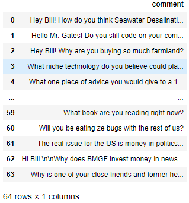

# Reddit Data Scraper using PRAW (Python Reddit API Wrapper)

This project demonstrates how to scrape Reddit data using Python and the PRAW library. It covers extracting subreddit information, posts, and comments using Reddit’s official API in a clean and beginner-friendly way.

---

## 🚀 Features

- Connect to Reddit using PRAW
- Read-only authentication
- Scrape subreddit metadata
- Extract hot and top posts
- Store scraped data in pandas DataFrames
- Scrape comments from a Reddit post

---

## 🛠️ Technologies Used

- Python 3
- PRAW (Python Reddit API Wrapper)
- Pandas

---

## 📸 Output

---

## ⚠️ Notes
- Never share your Reddit credentials publicly.
- Use environment variables for production projects.
- Respect Reddit’s API usage guidelines.

---

## 📌 Future Enhancements
- Save data to CSV.
- Add sentiment analysis.
- Support multiple subreddits.
- Add visualization using matplotlib or seaborn.
